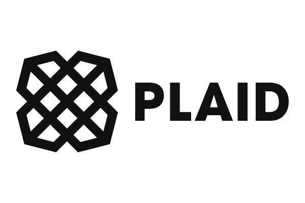

# RutgersFinTechBootcamp-Assignment1-MichaelCordes
Homework Assignment 1-Michael Cordes

## **Overview and Origin**
---   
### _**FinTech  Company Name**_: 

Plaid 

### _**Company incorporated**_:  

Plaid is currently a privately held company that was that was founded in 2013. Although, there has been speculation that the company will either be acquired or go public.  

### _**Company Founders**_: 

The founders of Plaid are Zach Perrett and William Hockey. 

### _**How the idea for Plaid originated**_:

The original concept for Plaid was to be a competitor to QuickBooks. The founders experienced complications while attempting to connect to different financial institution accounts during the process of building out the products for the original concept. The complications presented an opportunity to shift the primary business to develop an Application Programming Interface (API) for banking software.

### _**How was Plaid funded and how much funding have they received**_:

Plaid has received multiple rounds of funding. The original seed funding of $2.8 million came from Spark Capital, a venture capital firm with a proven track history of early-stage funding for many startups including Twitter, Slack, Affirm, and Coinbase. Additional rounds of funding came in November 2014 by New Enterprise Associates fir $12.5 million, in June 2016 by Goldman Sachs Investment Partners for $44 million, in December 2018 Mary Meeker, Index Ventures, and Andreessen Horowitz for $250 million, and in April 2021 by Altimeter Capital for $425M. The final round of founding placed a valuation of $13.4 billion on Plaid. 

## **Business Activities**
---

### _**What specific financial problem did Plaid  solve**_

Plaid initially set out to develop a financial planning tool to assist with personal budgets.  Even though the initial iteration of Plaid was not successful, Zach Perrett and William Hockley developed something even more impactful to the FinTech community.  Plaid quickly became the cheaper and quicker way for other startups to interact with established financial services companies.  The APIs developed by Plaid would speed up or eliminate development time which saves money and reduces burn rate of invested capital.  

### _**Who are Plaid's customers**_

Plaid’s intended customers are other fintech companies (both established and start-up) and financial services companies.  This is because Plaid provides infrastructure to immediately connect banks to other financial service providers and FinTechs.  Plaid is able provide real-time bank data to financial service providers for the purpose of payment processing, account linking, asset valuation, and risk mitigation.  

Some companies that span multiple FinTech domains that use Plaid:
<ul>
<li>Chime</li>
<li>Venmo</li>
<li>Live Oak Bank</li>
<li>Truebill</li>
<li>Upstart</li>
<li>EllieMae</li>
<li>Betterment</li>
<li>Acorns</li>
<li>Carvana</li>
<li>Placid</li>
<li>Robinhood</li>
<li>Coinbase</li>
</UL>

As it stands now, Plaid has explicitly stated (via their Privacy Policy) they do not sell the data collected. Other data aggregators within the domain already sell data to marketers.  Although, due to the data accessed and collected, Plaid is positioned to potentially add marketers as a customer in the future.  The common saying about social media: “If you’re not paying for the product, you are the product…” can be applied to Plaid and similar companies.  

### _**What solution does Plaid offer that their competitors do not or cannot offer**_

Plaid was one for the first API driven data aggregators to develop and gain acceptance in the banking and Fintech industries.  Their current technology can be replicated by competitors, however, Plaid’s successful partnership with the likes of Robinhood, Venmo, and Chime cannot be duplicated.  Additionally, the data already collected is something of value that cannot be replicated by competitors.

The technology is not something that creates an unfair advantage that Plaid can utilize, however, their brand, ease of use, and track record is their advantage.  Plaid has multiple billion-dollar FinTech companies utilizing their software.  The sheer size Plaid’s customer-base makes it difficult to compete.

### _**Which technologies are Plaid currently using and implementing**_

Plaid uses a robust library of Application Programming Interfaces (API) that work with multiple code languages.  Current supported API libraries include, Node, Python, Ruby, Java, and Go.  In addition to the API libraries supported by Plaid, there are direct links to an extensive of community developed and supported “Plaid Open APIs” in Plaid’s developer section of their website.

## **Landscape**
---

### _**What domain of the financial industry is the Plaid in**_

Plaid’s primary domain is Open Banking. Although, Plaid touches multiple domains of the financial services industry.  Plaid assists with the facilitation of payments by streamlining the user authentication as well as by mitigation risk with providing their customers with access to balance (think Venmo).  Plaid works in the lending domain by connecting lenders with banks for asset and income validation.  

### _**What are the other major companies in this domain?**_

Other Open Banking, or data aggregators, include Yodlee and Finicity.  Yodlee has been in the industry for over twenty years.  Finicity is backed by Mastercard and has been in the industry for almost twenty years.

## **Results**
---
### _**What has been the business impact of this Plaid so far?**_

Plaid has positioned itself as one of the top three open banking data aggregators in a short period of time.  The idea and development of the API technology by Plaid has decreased the development time and costs of many fintech companies.  Plaid was able to disrupt the common-place practice of micro-deposit validation when attempting to link bank accounts to bank accounts or bank accounts to other fintech services.  The micro-deposit validation created friction for consumers and financial institutions.  The practice extended customer on-boarding time and increased the likelihood of customers abandoning linking the accounts all together.  

### _**How is your company performing relative to competitors in the same domain?**_

Plaid was set to be acquired by Visa in 2020 for $5.3 billion.  At the time of the deal, the purchase price was double of the private valuation for Plaid.  Visa was interested in the purchase due to the market share of Plaid.  The API programs developed by Plaid is often referred to as the “plumbing” of connecting fintech companies to banks.  The attempted acquisition fell apart due to a lawsuit by the Department of Justice. 

Plaid has been named number 39 of the top 50 private company disrupters of 2021 by CNBC.  This is due to the continual growth of the company.  Plaid has claimed to have integrated with more than 11,000 banks and connected to more than 200 million consumer accounts

## **Recommendations**
---

### _**If I were an advisor to Plaid, I would suggest**_

As of now, Plaid’s customers are fintech companies and financial institutions.  Banks can decide to partner together to develop a competitor on their own, much like they did with Zelle to compete with the likes of Venmo and Square.  There are only a handful of core banking platforms which is the source data for Plaid.  If three or four of the banking software companies elect to fund their own startup to compete, they could do it with greater knowledge of the infrastructure and for cheaper.  

Plaid needs build services onto the developed APIs and expand the targeted customer population.  Expanding the customer base can be achieved by creating services or additional APIs that the users of the fintech companies and financial institutions would want to use. For example, Plaid could develop an app that allows users to shop services of the companies already using Plaid.  The financial services marketplace can increase revenue by receiving commissions based on new products opened.  Additionally, Plaid could create a subscription services for that would use robo-advising for product marketing, consumer investment, savings, or payment processing.   

### _**Why I beleive that offering this product or service would benefit Plaid**_

Adding robo-advising subscription model could assist consumers with personal budgeting or saving.  This can be achieved by monitoring spend patterns across all Plaid linked accounts and Plaid can proactively transfer funds from a checking to savings account when all the monthly bills have been paid.  Plaid can develop alerts when customers are spending too much or have deviated from their budget and make the necessary transfers from a savings back to checking accounts to ensure no overdraft fees are received if monthly bills may be outstanding.  Finally, Plaid can make recommendations to increase savings and investment or reduce expenses by alerting the customer to unnecessary spending.
Plaid will also need to offer marketing analytics like their peers, Yoodle and Finicity.  This would allow Plaid to unlock additional revenue streams as well as mitigate risk of competition.  To ensure continued growth of the company, Plaid needs to capitalize on their current place in the market as one of the top data aggregators and open banking companies in the industry.  

### _**What technologies would this additional product or service utilize?**_

Plaid would need to invest in the development of a consumer-facing app that could serve as a centralized hub for customers that want to utilize the financial services marketplace.   Another technology that would be utilized will be machine learning for the robo-advising services.  

## **Resources**
---

•	https://plaid.com/company/ 

•	https://www.barrons.com/articles/plaid-likely-to-go-public-after-failed-sale-to-visa-51610583855 

•	https://plaid.com/use-cases/consumer-payments/ 

•	https://plaid.com/use-cases/lending/ 

•	https://www.sparkcapital.com/companies 

•	https://www.cnbc.com/2018/12/11/plaids-250-million-funding-round-propels-it-to-2point7-billion-valuation.html 

•	https://techcrunch.com/2021/04/07/plaid-raises-425m-series-d-from-altimeter-as-it-charts-a-post-visa-future/  

•	https://www.forbes.com/plaid-fintech/#7d2331f367f9

•	https://www.eff.org/deeplinks/2020/11/visa-wants-buy-plaid-and-it-transaction-data-millions-people (

•	https://www.yodlee.com/company 

•	https://www.finicity.com/company/ 

•	https://www.cnbc.com/2020/01/13/visa-to-acquire-plaid-the-fintech-powering-venmo-and-other-banking-apps-for-5point3-billion.html 

•	https://www.cnbc.com/2021/05/25/plaid-disruptor-50.html 

•	https://stackshare.io/plaid 

•	https://plaid.com/docs/api/libraries/

•	Crosman, Penny. "Plaid leads effort to raise the bar on fintechs' data security" *American Banker*, November 19, 2021 VOL. 186 No 223, pg 6.